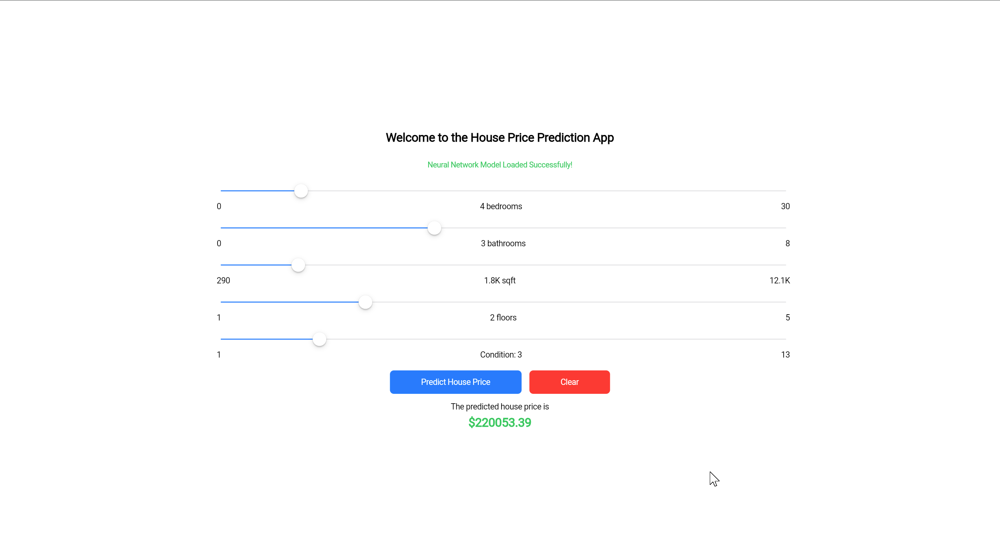

# House Price Prediction App

## Overview
The House Price Prediction App is a Flutter application designed to predict house prices based on various features. Leveraging machine learning models, this app provides accurate and real-time predictions, making it a valuable tool for both buyers and sellers in the real estate market.

## Features
- **Interactive UI:** User-friendly interface to input house features.
- **Real-Time Predictions:** Instant price predictions using TFLite for on-device machine learning inference.
- **Historical Data Tracking:** Keep track of previous predictions for comparison and analysis.

## Screenshots
1. 
2. 
3. 

## Getting Started
Follow these instructions to get a copy of the project up and running on your local machine.

### Prerequisites
- Flutter SDK
- Dart SDK

### Installation
1. Clone the repository:
   ```sh
   git clone https://github.com/zaid-kamil/flutter_house_price_prediction.git
   ```
2. Navigate to the project directory:
   ```sh
   cd flutter_house_price_prediction
   ```
3. Install dependencies:
   ```sh
   flutter pub get
   ```

### Running the App
To run the app on an emulator or physical device, use:
```sh
flutter run
```

## Built With
- **Flutter:** The UI toolkit for building natively compiled applications.
- **TFLite:** TensorFlow Lite for on-device machine learning.

## Contributing
Contributions are welcome! Please read the [contribution guidelines](CONTRIBUTING.md) first.

## License
This project is licensed under the MIT License - see the [LICENSE](LICENSE) file for details.
